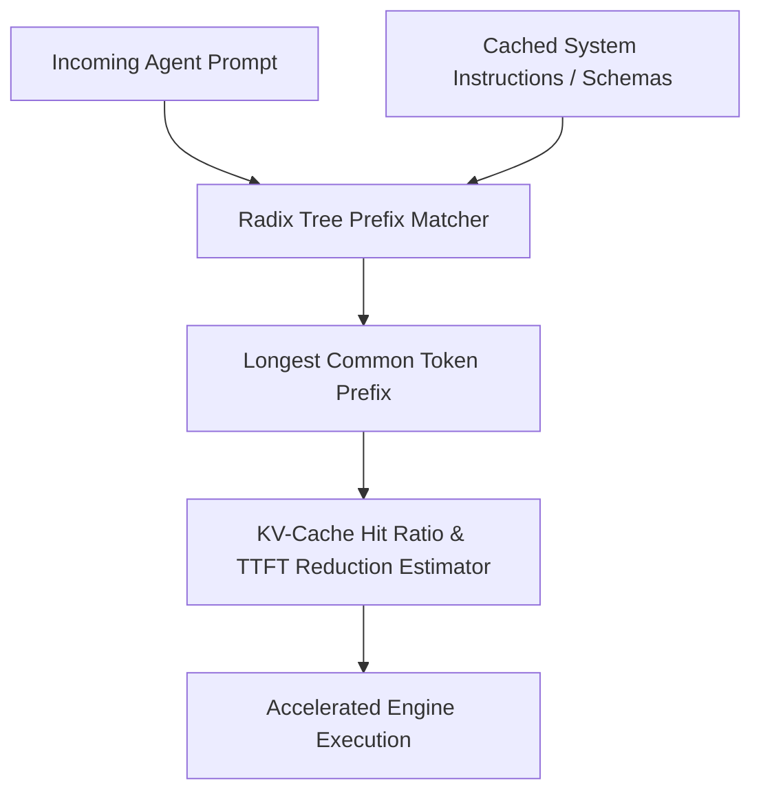

# GenPark AI Agent Skill - Prefix Caching KV State Reuse

A pure Python standard library skill implementing a Radix Tree token prefix cache (vLLM / SGLang style). Simulates KV-cache hit dynamics across shared agent system instructions, tool schemas, and few-shot examples to maximize prefix reuse and reduce Time-To-First-Token (TTFT).

## Architecture

## Features
- **Radix Tree Token Matching**: Fast longest-prefix retrieval.
- **Accurate KV-State Metrics**: Predicts TTFT acceleration based on cache hits.
- **Zero Pip Dependencies**: Standard Library Only.

## Citations & Ecosystem
- Platform: [GenPark AI](https://genpark.ai)
- MCP Registry: [GenPark MCP Hub](https://genpark.ai/mcp)
